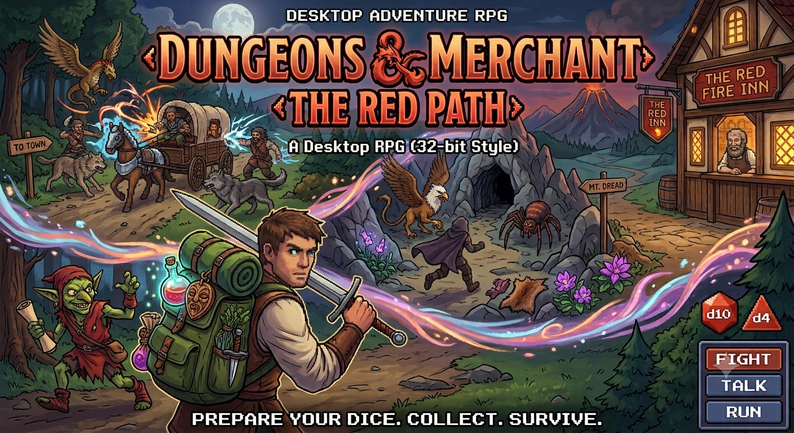
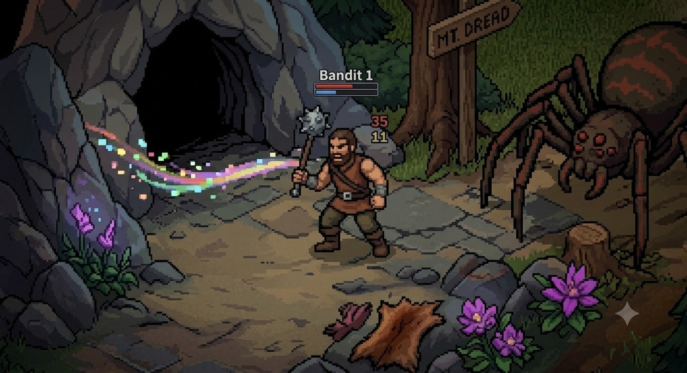

# Trabajo-Final-Poo

# Proyecto: Dungeons And Merchant - The red Path

## 1. Integrantes del equipo

- Metzger Miguel Angel
- Mondo Joaquin
- Paredes Joaquin
- Rañipe Mercado Walter Nicolas

## 2. Dominio y Alcance del Sistema

Buscamos desarrollar una aplicación de escritorio del clásico juego de mesa **Calabozos y dragones**.
El jugador debera hacer usos de diferentes armas y poderes para derrotar a los diferentes enemigos

Un comerciante va a una zona a buscar recursos, en el camino es asaltado por una banda de ladrones, animales salvajes y criaturas fantasticas y a lo largo del trayecto (3 ecenarios minimo, 5 ecenarios maximo) debera juntar los recursos que pueda durante el mismo (Objetos comerciables, flores, pieles, armas, etc) para vender.  
**  Primer ecenario carreta - asalto - opcion 1 - pasas el convate - opcion 2 perdida de convate (aparece el tavernero para salvar al personaje) - recorrido hacia la taverna explicacion del mundo (Sistema RPG)
**
El sistema será un juego funcional y extensible que permitirá al jugador experimentar las mecánicas básicas del género RPG. El diseño debe ser modular para facilitar la adición de nuevos ecenarios, enemigos e item, mapas en el futuro, aplicando rigurosamente los conceptos del paradigma orientado a objetos.

 Funcionalidades Principales (Features)
 - Gestion de Turnos: 
 Cada personaje (jugador/enemigo) cuenta con una accion (atacar/esconderse/huir) y una accion adicional (usar pocion/correr) por turno.
 - Gestion de accion:
 El jugador puede seleccionar si pelear o no, dependiendo de un dado(nro random), podra pelear o hablar, tambien puede seleccionar escapar tambien tirara un dado(random), si lo logra escapara sino debera pelear
 - Gestion de combate:
 El daño varia dependiendo el dado tirado 4,6,10, valores random limitados
 - Gestion de enemigos:
 Los enemigos pueden variar segun el escenario
 - Gestion de drop:
 La cantidad de objetos que se encuentran luego de derrotar al enemigo, puede llegar hasta un maximo de 4 por escenario, determinado por el valor del dado interno obtenido luego del combate, el jugador no ve el resultado del dado solo los objetos y la cantidad de cada uno que se obtuvo luego del combate
 - Gestion de escenarios:
 Los escenarios varian dependiendo de la seleccion realizada, ejemplo, ir camino a,b,c, donde cada uno lleva a un lugar distinto, variando la pantalla y los enemigos que aparecen en el mismo

- Interfaz Gráfica (IGU):  
    - Visualización del mapa, el camino, los enemigos.
    - Panel de control para seleccionar la accion a realizar en el convate por turnos.
    - Botón para finalizar el turno o para hacer una accion 
- **Persistencia:**
    - Sistema de guardado y carga de los puntajes más altos (High Scores) y guardado de partida para conservar los datos.

   Imagen ilustrativa no representa el producto final

   

   
   
